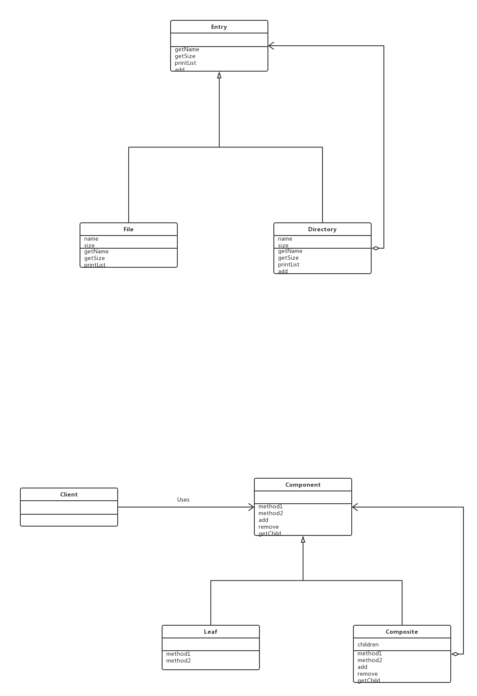

# Composite模式

诸如计算机的文件系统，有文件夹的概念，文件夹中可以放文件，也可以放文件夹(子文件夹)，同时，子文件夹中，一样可以放入文件、文件夹。可以说，文件夹形成了一种容器结构、递归结构。

其实，我们不妨可以这样想:虽然文件夹与文件是不同类型的对象，但是它们都“可以被放入文件夹中”，所以我们可以将文件夹和文件看成一种类型的东西--目录条目，也就是将容器和内容作为一种东西对待。在容器中既能放入内容，也可以放入小容器，然后小容器中，又可以继续放入更小的容器。

Conposite模式就是用于创造出这样的结构的模式，它**能使容器与内容具有一致性，创造出递归结构。**

