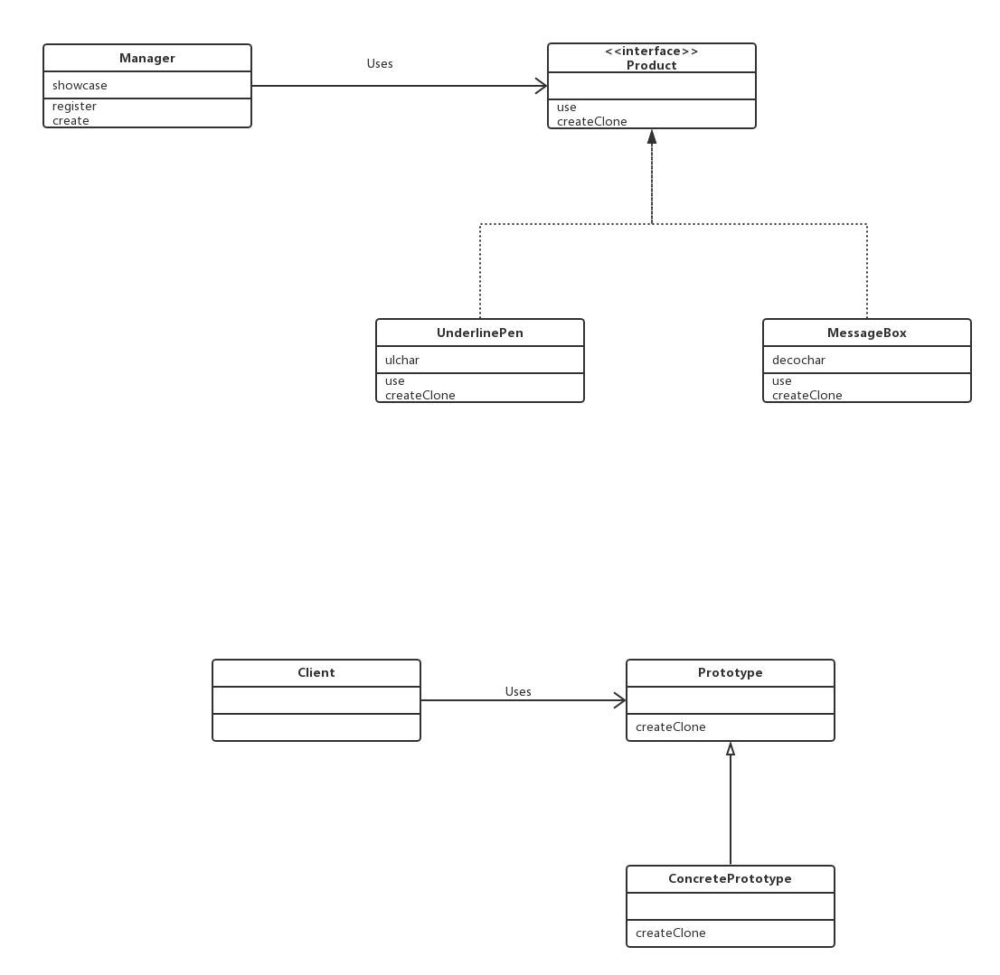

## Prototype 模式

* Prototype（抽象原型类）

Product角色负责定义用于复制现有实例来生成新实例的方法。在示例程序中的Product接口就是该角色。

* ConcretePrototype（具体原型类）

ConcretePrototype角色负责实现复制现有实例并生成新实例的方法。在示例程序中，MessageBox和UnderlinePen都是该角色。
 

* Client（客户类/使用者）

Client角色负责使用复制实例的方法生成新的实例。在示例程序中，Manager类扮演的就是该角色。

