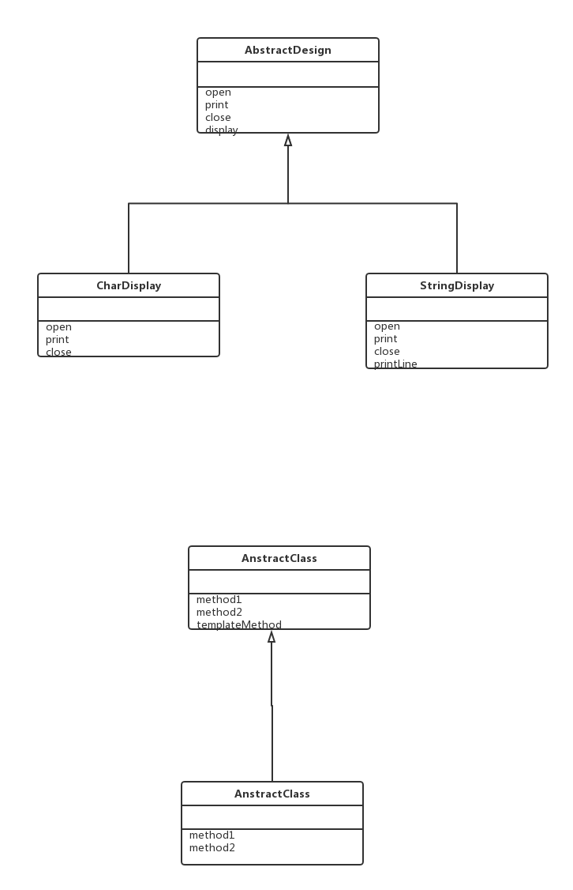

# Template Method模式

在父类中定义抽象方法，父类只负责将抽象方法的组合成模板，将具体实现交给子类，也就是说，只要在子类中实现不同的处理，当父类的模板方法被调用的时候，程序的行为也会不同。但不变的是，不论子类中的具体实现如何，处理的流程都会按照父类定义好的模板去进行。

像这样在父类中定义处理流程的框架，在子类中实现具体处理的模式就成为Template Method模式。

